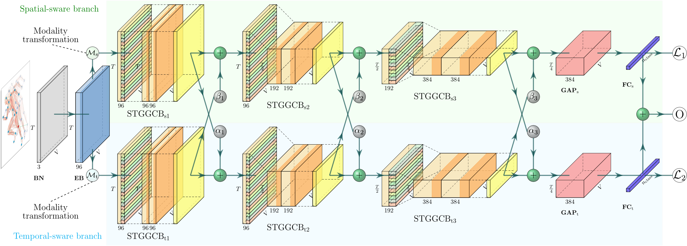

# EGGCN: Efficient Group Graph Convolutional Network for Skeleton-Based Action Recognition

This repo is the official implementation for *EGGCN: Efficient Group Graph Convolutional Network for Skeleton-Based Action Recognition*. 



<center>
Framework overview of our proposed method: EGGCN is a novel model for skeleton-based action recognition, which achieves comparable performance on several large-scale datasets. The model uses a group spatial-temporal graph convolution to extract hierarchical features from the input skeleton sequences, and leverages efficient design choices to reduce the computational cost and memory footprint of the model.
</center>

## Prerequisites

- Python >= 3.6
- PyTorch >= 1.1.0
- PyYAML, tqdm, tensorboardX

We provide the [dependency file](./requirements.txt) of our experimental environment, one can install all dependencies by creating a new anaconda virtual environment and running `pip install -r requirements.txt`

## Data Preparation

*Disk usage warning: after preprocessing, the total sizes of datasets are around 38GB, 77GB, 63GB for NTU RGB+D 60, NTU RGB+D 120, and Kinetics 400, respectively. The raw/intermediate sizes may be larger.*

### Download datasets

There are 3 datasets to download:

- Kinetics Skelton 400
- NTU RGB+D 60 Skeleton
- NTU RGB+D 120 Skeleton

#### Kinetics Skeleton 400

1. Download dataset from ST-GCN repo: https://github.com/yysijie/st-gcn/blob/master/OLD_README.md#kinetics-skeleton
2. [This](https://silicondales.com/tutorials/g-suite/how-to-wget-files-from-google-drive/) might be useful if you want to `wget` the dataset from Google Drive


#### NTU RGB+D 60 and 120

1. Request dataset here: http://rose1.ntu.edu.sg/Datasets/actionRecognition.asp
2. Download the skeleton-only datasets:
   1. `nturgbd_skeletons_s001_to_s017.zip` (NTU RGB+D 60)
   2. `nturgbd_skeletons_s018_to_s032.zip` (NTU RGB+D 120)
   3. Extract above files to `./data/nturgbd_raw`

### Data Processing

#### Directory Structure

Put downloaded data into the following directory structure:

```bash
- data/
  - kinetics/
  	  - kinetics
      - kinetics_raw/
        - kinetics_train/
          ...
        - kinetics_val/
          ...
        - kinetics_train_label.json
        - keintics_val_label.json
  - nturgb+d
      - ntu/
      - ntu120/
      - nturgbd_raw/
        - nturgb+d_skeletons/     # from `nturgbd_skeletons_s001_to_s017.zip`
          ...
        - nturgb+d_skeletons120/  # from `nturgbd_skeletons_s018_to_s032.zip`
          ...
```

#### Generating Data

- Generate Kinetics Skeleton 400 dataset:

```bash
cd ./data/kinetics/kinetics
# Get skeleton of each performer
python3 kinetics_gendata.py 
```

- Generate NTU RGB+D 60 or NTU RGB+D 120 dataset:

```bash
 cd ./data/nturgb+d/ntu # or cd ./data/nturgb+d/ntu120
 # Get skeleton of each performer
 python get_raw_skes_data.py
 # Remove the bad skeleton 
 python get_raw_denoised_data.py
 # Transform the skeleton to the center of the first frame
 python seq_transformation.py
```

## Training

- Change the config file depending on what you want.

```bash
# Example: training EGGCN on NTU RGB+D 60 cross subject
python main.py \
    --config ./config/nturgbd-cross-subject/train.ymal \
    --phase test --bone False --vel False --multi_input True \
    --device 0 1 2 3
```

## Testing

- Change the config file depending on what you want.

```bash
# Example: training EGGCN on NTU RGB+D 60 cross subject
python main.py \ 
    --config config/nturgbd-cross-subject/test23.yaml \ 
    --phase test --bone False --vel False --multi_input True \
    --device 0 1 2 3 --test_batch_size 64 \ 
    --weights ./pre_trained/ntu/xsub/joint/weights-67-15611.pt
```

### Pre-trained Models

We provide the pre-trained model at `./pre_trained/ntu/xsub/joint/weights-67-15611.pt`.

## Acknowledgements

This repo is based on [2s-AGCN](https://github.com/lshiwjx/2s-AGCN). The data processing is borrowed from [MS-G3D](https://github.com/kenziyuliu/MS-G3D) and [CTR-GCN](https://github.com/Uason-Chen/CTR-GCN). Thanks to the original authors for their work!


## Contact
For any questions, feel free to contact me via `zhoukanglei@qq.com`.